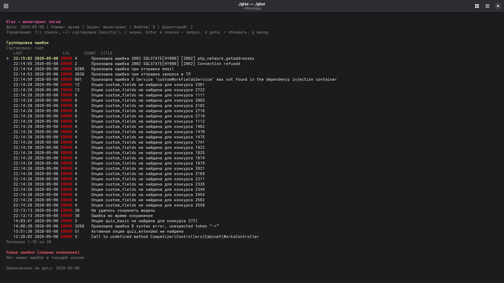
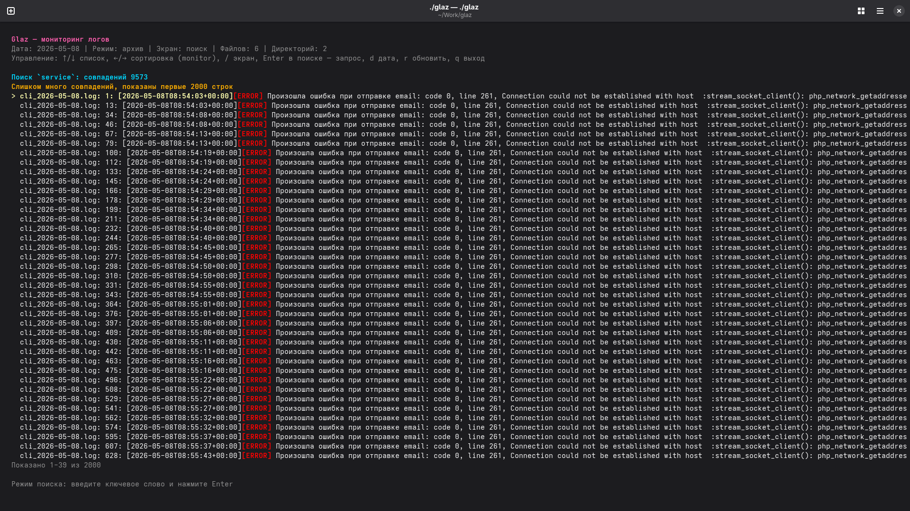

# Glaz


Terminal UI application for log monitoring with error grouping, realtime updates, and cross-file search.

- Russian documentation: [`doc/README.ru.md`](doc/README.ru.md)

## Features

- Groups errors by `level + normalized title`.
- Cleans noisy titles (for example, ignores non-meaningful values like `29#29`).
- Shows `last seen`, `level`, `count`, and error title in a sortable monitor table.
- Tracks today's logs in realtime, including newly created files.
- Falls back to the previous day if today's logs are missing on startup.
- Highlights newly appeared error groups with full entry preview.
- Provides dedicated search mode for all tracked files of the selected day.
- Supports keyboard sorting in monitor mode (`last`, `lvl`, `count`).

## Screenshots

### Monitor Mode



### Search Mode



## Configuration

By default, Glaz reads `glaz.json` from the project root.
If the file does not exist, it is created automatically.

Example:

```json
{
  "log_dirs": [
    "/home/yaonkey/Work/s/logs",
    "/home/yaonkey/Work/s/logs/nginx"
  ]
}
```

`log_dirs` is a list of directories to scan for log files (including PHP/nginx paths).

## Run

```bash
go run . -config glaz.json -date 2026-05-08
```

Flags:

- `-config`: path to JSON configuration file.
- `-date`: log date in `YYYY-MM-DD` format.

Behavior:

- If the selected date is today, Glaz runs in realtime mode.
- For historical dates, Glaz works in archive mode (no tailing).
- If startup date is today and no logs are found, Glaz opens the previous day automatically.

## TUI Controls

- `↑/↓` or `j/k`: move within current list.
- `←/→` or `h/l`: change sorting in monitor mode.
- `/`: switch between monitor and search screens.
- `Enter` in search screen: set or update query.
- `d`: change date (`YYYY-MM-DD`).
- `r`: refresh.
- `q`: quit.

## Architecture

- `main.go`: app bootstrap and process lifecycle.
- `config.go`: configuration loading/creation.
- `monitor.go`: file discovery, scanning, tailing, and session orchestration.
- `parser.go`: PHP/nginx header parsing and title normalization.
- `analyzer.go`: thread-safe aggregation and new-event tracking.
- `search.go`: streaming cross-file full-text search.
- `tui.go`: Bubble Tea + Lip Gloss interface and keyboard UX.

## Tests

Run:

```bash
go test ./...
```

Current local result:

```text
ok  	github.com/yaonkey/glaz	0.009s
```

## License

Released under the [MIT License](LICENSE).
